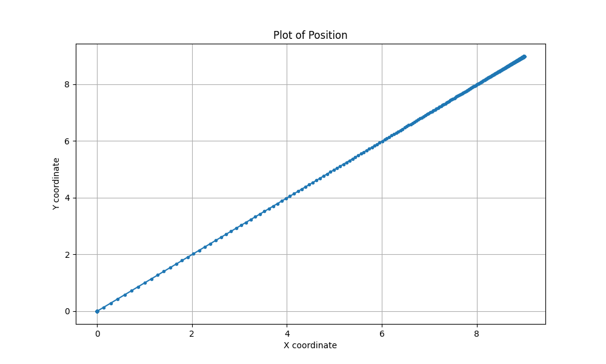
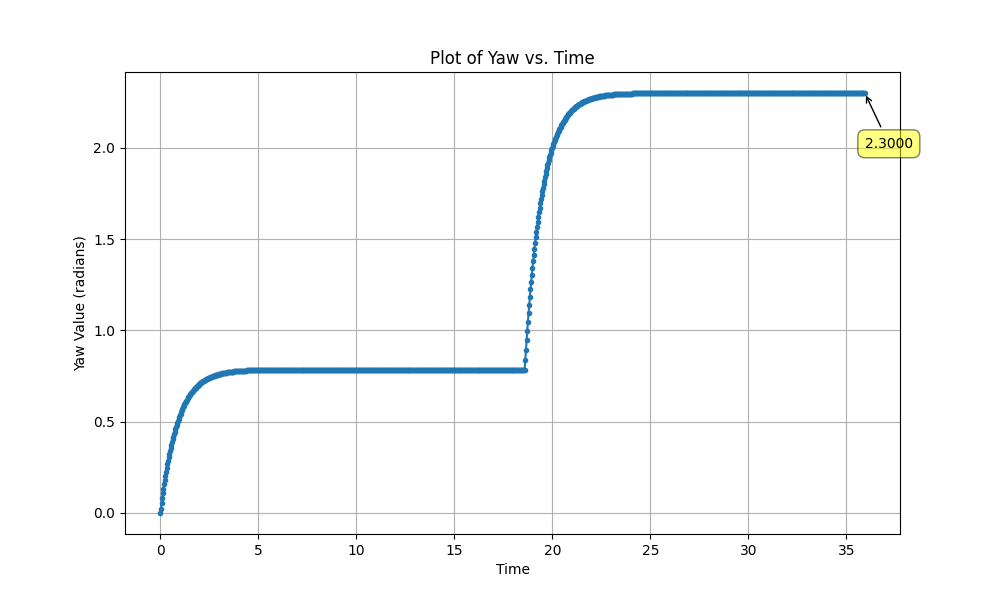
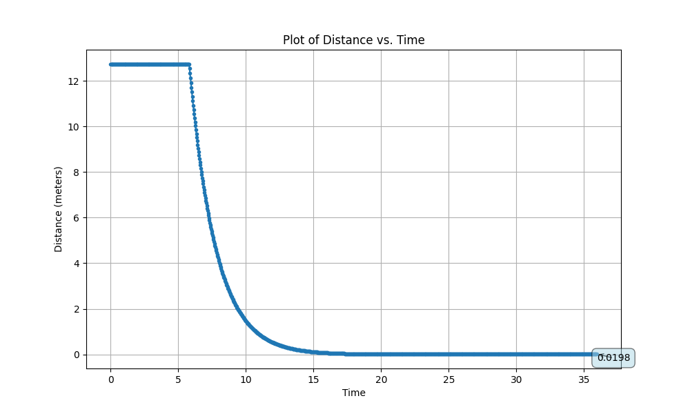

# Task Description

Please read through [this](https://www.overleaf.com/read/dmgrrcmpkbkq#211e69) document before moving forward.

### The Control Algorithm

This project implemented a simple **Proportional (P) controller** to get a robot from point A to point B in a grid at a desired orientation.

The controller measures an error (whether it be distance or orientation) between sensor feedback & desired state, and then applies a control signal to the plant proportional to this error to reduce it. 

Intuitively, a larger error is given a proportionally larger correction signal than a smaller error.

The goal point & orientation are currently set manually in `workspace/limo_control/p-control.cpp`.

Each "cycle" of getting the robot to the goal consisted of three parts:
- Orient the robot using P control towards the goal point, which will be known in the control program as "finding the point"
- Adjust speed using P control while heading straight towards the point, also known as being "en route"
- Once at the point, adjust heading to the desired value as set, also known as having "arrived" (at the point).

The above described control algorithm was then implemented using a ROS2 node in C++, which does the following:

**Subscription:** it subscribes to the topic `odom` for the robot sensor signal. This includes the positional xyz coordinates & quaternion coordinate orientation values.

Once a feedback sensor signal is received, the subscription callback funciton subsequently calls a function called `computeOutputs()` which will determine output signal values via the current robot state (finding point, en route, or arrived).

The output signal contains two key values for our purpose: the linear velocity and angular velocity.

**Publication:** Every 10 milliseconds, a publisher function is called from the ROS node, which takes the precalculated output signal of linear & angular velocity, and sends them to all subscribers to the `cmd_vel` topic.

**Results:**

The x and y coordinates changed linearly over time, as shown below. One can see that its distance correction was very strong, as in the simulation, the car even jolted, even shot over:



The yaw was first changed to go straight to the point, then changed again to match the desired orientation (currently 2.3 radians) with perfect precision.



The Euclidean distance to the point was reduced to 1.98 centimeters at the final state, well below the required 3 centimeters.



### Software Structure
```
- docker -- Where the Dockerfile lives.
- scripts -- Where necessary external scripts live.
- workspace -- Where all the packages live.
- plots -- Where result plots live
```

### Build the simulator

```bash
./scripts/build/sim.sh
```

### Run the simulator

```bash
./scripts/deploy/devel.sh # To enter the docker container
ros2 launch limo_simulation limo.launch.py # To launch the simulator
```

### What do I edit?

1. Modify the package `limo_control` in the workspace directory for adding your c++ controller program.
2. Make a launch file that can launch everything (Controller and Simualation).
3. Modify `scripts/deploy/app.sh` such that, when `scripts/deploy/start.sh` is run, the task is executed automatically.

### Known Issues

1. This will not work with docker desktop, please do not use it, use the default engine.

Feel free to modify anything else if it does not work as expected.